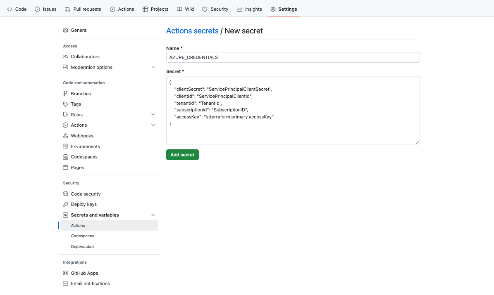

# FastAPI Azure Function App Template

This repository contains code and github workflows to deploy a simple FastAPI server as a free azure function app.

## Before starting

To deploy this template code, you will first need:  
    - Your azure service principle ClientID & Client Secret   
    - A resource group  
    - A storage account for terraform files  
        - Within that storage account, a container named "tfstate"  

> [!IMPORTANT]
> This repo assumes you are following azure naming best practices as outlined [here](https://learn.microsoft.com/en-us/azure/cloud-adoption-framework/ready/azure-best-practices/resource-naming)
> [!TIP]
> Under Azures naming conventions, your resource group should be something like "rg-PROJECTID-dev-eau-001", and your terraform storage account should be something like "stterraformdeveau001"

## Getting Started
### Importing this repository & setting up your github
If you are starting from scratch, the easiest way to get started with this template code is to clone this repo and remove the git folder

```sh
git clone https://github.com/Stephen-Hallett/FastAPI-FunctionApp-Template.git YOUR_PROJECT_NAME
cd YOUR_PROJECT_NAME
cd rm -rf .git media
```

With the git folder removed you can create your own project. First create a repository on your github, and keep note of the link you need to clone the repository, this is your "GITHUB_LINK".

> [!IMPORTANT]
> This repo assumes you are creating a development stage project, so the github workflow files track the "dev" branch. If you are in a different stage of development, you should change "dev" below to your chosen stage, and edit the github workflow files to track your branch.

```sh
git init
git add .
git commit -m "feat: Initial commit"
git branch -M dev
# Create your
git remote add origin GITHUB_LINK
git push -u origin dev
```
> [!NOTE]
> Pushing this to your github will make two workflows run and fail, this is fine! You still need to update some information before they will work.

#### Adding your azure details to github actions
In the root of the repository there is a template.secrets.json file. Rename this file to **secrets.json** This file needs to be populated, and the contents need to be added to your github secrets. Fill the clientId & clientSecret with your service principal values, and fill the remaining fields with the results of the following.
> [!IMPORTANT]
> Failure to rename the template.secrets.json file to secrets.json could result in you uploading your secret variables to github if you are not careful.

```sh
# Get tenantId
az account show --query "tenantId" -o tsv
# Get subscriptionId
az account show --query "id" -o tsv
# Get accessKey (Assuming resource group rg-PROJECTID-dev-eau-001 & terraform storage account stterraformdeveau001)
az storage account keys list --resource-group rg-PROJECTID-dev-eau-001 --account-name stterraformdeveau001 --query "[0].value" -o tsv
```

#### Add the contents of this file to your github secrets
> [!IMPORTANT]
> The secret variable MUST be named AZURE_CREDENTIALS in order to work properly with the github actions workflows.



### Updating infrastructure code

#### Updating terraform variables
#### Updating infrastructure workflow project Id
#### Updating python version manually

### Updating FastAPI code

#### Updating App name
#### Updating function app workflow file